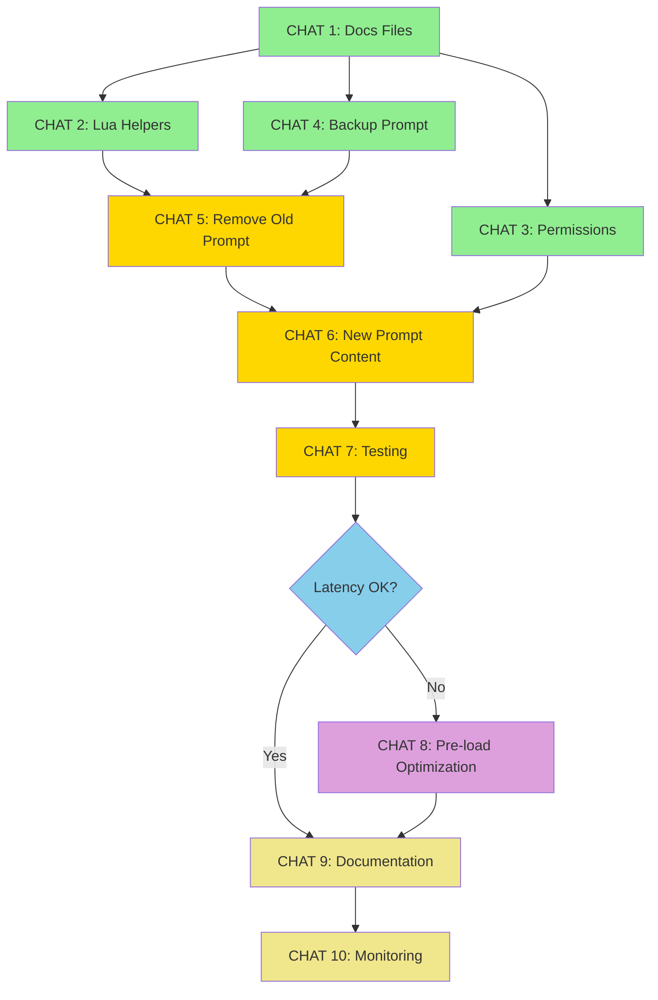

# 🗺️ ROADMAP: Sistema Scalabile per Documentazione LLM

## 📋 Panoramica
Implementazione progressiva del sistema di documentazione on-demand per ridurre il system prompt da ~10KB a ~2KB, suddivisa in chat incrementali e indipendenti.

---

## 🎯 CHAT 1: Setup Struttura Documentation Files
**Tempo stimato:** 30-45 minuti
**Complessità:** Bassa
**Dipendenze:** Nessuna

### Obiettivo
Creare la struttura base dei file di documentazione in formato JSON/Markdown nella directory `/data/memory/docs/`.

### Task
1. ✅ Creare directory `/data/memory/docs/`
2. ✅ Creare `api_reference.json` con tutte le API Lua
   - GPIO (write, read, toggle)
   - WebData (fetch_once, read_data, list_files)
   - Memory (read_file, write_file, append_file, delete_file, list_files)
   - BLE (type, press, release, click)
   - Audio (play_file, stop, set_volume)
   - Display (print, clear, set_brightness)
   - LED (set, clear, set_brightness)
   - System (reboot, sleep, get_battery, get_uptime)
3. ✅ Creare `cities.json` con coordinate delle 13 città italiane
4. ✅ Creare `weather_api.md` con guida Open-Meteo
5. ✅ Creare `examples.json` con template per scenari comuni

### File Creati
```
/data/memory/docs/
├── api_reference.json  (~8KB)
├── cities.json         (~1KB)
├── weather_api.md      (~2KB)
└── examples.json       (~3KB)
```

### Verifica Successo
```bash
ls -lh data/memory/docs/
cat data/memory/docs/cities.json
```

### Output per Next Chat
- [ ] Path completi dei file creati
- [ ] Size totale della directory docs/
- [ ] Conferma validità JSON (test parse)

---

## 🎯 CHAT 2: Implementare Helper Lua `docs.*`
**Tempo stimato:** 45-60 minuti
**Complessità:** Media
**Dipendenze:** CHAT 1 completata

### Obiettivo
Aggiungere helper Lua nel sandbox per accesso facile alla documentazione.

### Task
1. ✅ Leggere `src/core/voice_assistant.cpp` (metodo `setupSandbox`)
2. ✅ Identificare dove vengono registrate le API Lua (~linea 1700)
3. ✅ Aggiungere namespace `docs` con funzioni:
   ```lua
   docs = {
       get = function(name) return memory.read_file("docs/" .. name) end,
       api = function() return memory.read_file("docs/api_reference.json") end,
       cities = function() return memory.read_file("docs/cities.json") end,
       weather = function() return memory.read_file("docs/weather_api.md") end,
       examples = function() return memory.read_file("docs/examples.json") end
   }
   ```
4. ✅ Compilare e testare su device

### File Modificati
- `src/core/voice_assistant.cpp` (+30 righe circa)

### Test di Verifica
```lua
-- Test 1: Accesso API reference
local api = docs.api()
println(api)

-- Test 2: Accesso coordinate città
local cities = docs.cities()
println(cities)

-- Test 3: Accesso diretto
local weather_guide = docs.get("weather_api.md")
println(weather_guide)
```

### Output per Next Chat
- [ ] Conferma compilazione riuscita
- [ ] Log output test Lua
- [ ] Screenshot o log risposta LLM quando usa `docs.cities()`

---

## 🎯 CHAT 3: Permessi Read-Only per `/docs`
**Tempo stimato:** 30 minuti
**Complessità:** Bassa
**Dipendenze:** CHAT 1 completata

### Obiettivo
Configurare MemoryManager per rendere la directory `/docs` read-only, impedendo modifiche accidentali.

### Task
1. ✅ Leggere `src/core/memory_manager.cpp` (costruttore)
2. ✅ Identificare `directory_permissions_` map
3. ✅ Aggiungere entry per `/documentation`:
   ```cpp
   directory_permissions_["/documentation"] = {"", true, false, false};
   // Format: {prefix, allow_read, allow_write, allow_delete}
   ```
4. ✅ Testare che:
   - ✅ `memory.read_file("docs/cities.json")` funzioni
   - ✅ `memory.write_file("docs/test.txt", "data")` fallisca con errore

### File Modificati
- `src/core/memory_manager.cpp` (+1 riga)

### Test di Verifica
```lua
-- Test 1: Read OK
local data = memory.read_file("docs/cities.json")
println(data)  -- Expected: JSON content

-- Test 2: Write FAIL
local result = memory.write_file("docs/hack.txt", "forbidden")
println(result)  -- Expected: Error "Write not permitted"
```

### Output per Next Chat
- [ ] Log test read (successo)
- [ ] Log test write (errore atteso)

---

## 🎯 CHAT 4: Backup System Prompt Attuale
**Tempo stimato:** 15 minuti
**Complessità:** Bassa
**Dipendenze:** Nessuna

### Obiettivo
Salvare versione attuale del system prompt per reference e rollback.

### Task
1. ✅ Leggere `src/core/voice_assistant.cpp` (metodo `getSystemPrompt`)
2. ✅ Copiare contenuto completo in `docs/SYSTEM_PROMPT_ORIGINAL.md`
3. ✅ Annotare:
   - Numero righe totali
   - Size in bytes
   - Token count stimato (~2500 token)
4. ✅ Identificare sezioni da rimuovere:
   - API documentation (~100 righe)
   - Coordinate città (~13 righe)
   - Open-Meteo guide (~30 righe)
   - Esempi JSON (~20 righe)

### File Creati
- `docs/SYSTEM_PROMPT_ORIGINAL.md` (~10KB)
- `docs/SYSTEM_PROMPT_SECTIONS.md` (annotazioni sezioni)

### Output per Next Chat
- [ ] Conferma backup salvato
- [ ] Metriche baseline (righe, bytes, token)
- [ ] Lista sezioni da rimuovere con line numbers

---

## 🎯 CHAT 5: Ridurre System Prompt (Parte 1 - Rimozione)
**Tempo stimato:** 45 minuti
**Complessità:** Media
**Dipendenze:** CHAT 2, 4 completate

### Obiettivo
Rimuovere documentazione API dal system prompt, sostituendola con riferimenti a `docs.*`.

### Task
1. ✅ Aprire `src/core/voice_assistant.cpp` (metodo `getSystemPrompt`)
2. ✅ Rimuovere sezioni:
   - API GPIO (~15 righe)
   - API BLE (~20 righe)
   - API WebData (~15 righe)
   - API Memory (~15 righe)
   - API Audio (~10 righe)
   - API Display (~10 righe)
   - API LED (~10 righe)
   - API System (~10 righe)
3. ✅ Rimuovere coordinate città (~13 righe)
4. ✅ Rimuovere guida Open-Meteo (~30 righe)
5. ✅ Rimuovere esempi JSON (~20 righe)

### File Modificati
- `src/core/voice_assistant.cpp` (-158 righe)

### Metriche Target
- **Prima:** ~161 righe, ~10KB
- **Dopo:** ~50 righe, ~3KB (reduction temporanea)

### Verifica
```bash
# Confronta size
wc -l src/core/voice_assistant.cpp
```

### Output per Next Chat
- [ ] Diff delle modifiche
- [ ] Nuovo line count
- [ ] Conferma che compila senza errori

---

## 🎯 CHAT 6: Ridurre System Prompt (Parte 2 - Nuovo Content)
**Tempo stimato:** 60 minuti
**Complessità:** Media
**Dipendenze:** CHAT 5 completata

### Obiettivo
Aggiungere sezione compatta con istruzioni per usare `docs.*` e pattern 2-step.

### Task
1. ✅ Aggiungere sezione **API DISPONIBILI**:
   ```cpp
   prompt += "\n**API DISPONIBILI:**\n";
   prompt += "Per documentazione completa, usa:\n";
   prompt += "- `docs.api()` - Tutte le funzioni Lua\n";
   prompt += "- `docs.cities()` - Coordinate città italiane\n";
   prompt += "- `docs.weather()` - Guida Open-Meteo\n";
   prompt += "- `docs.examples()` - Template JSON\n\n";
   ```

2. ✅ Aggiungere sezione **PATTERN D'USO**:
   ```cpp
   prompt += "**PATTERN D'USO:**\n";
   prompt += "Se non conosci sintassi API:\n";
   prompt += "  Step 1: println(docs.api())\n";
   prompt += "  Step 2: Usa info per eseguire comando\n\n";
   ```

3. ✅ Aggiungere sezione **ESEMPI RAPIDI** (minimal):
   ```cpp
   prompt += "**ESEMPI RAPIDI:**\n";
   prompt += "- Meteo: webData.fetch_once('URL', 'weather.json')\n";
   prompt += "- GPIO: gpio.write(23, true)\n";
   prompt += "- Memory: memory.read_file('file.txt')\n";
   ```

### File Modificati
- `src/core/voice_assistant.cpp` (+25 righe di nuovo content)

### Metriche Target Finali
- **Righe totali:** ~75 (vs 161 originali) = -53%
- **Size:** ~2KB (vs 10KB originali) = -80%
- **Token count:** ~500 (vs 2500 originali) = -80%

### Verifica
```bash
# Test completo
make flash
# Chiedi all'LLM: "Che tempo fa a Milano?"
# Expected: LLM usa docs.cities() poi fa fetch meteo
```

### Output per Next Chat
- [ ] Metriche finali (size, token count)
- [ ] Test log completo query meteo
- [ ] Screenshot risposta utente

---

## 🎯 CHAT 7: Testing & Validation
**Tempo stimato:** 60-90 minuti
**Complessità:** Media
**Dipendenze:** CHAT 6 completata

### Obiettivo
Testare tutti gli scenari critici e validare che non ci siano regressioni.

### Test Suite

#### Test 1: Basic Docs Access
```
User: "Quali API sono disponibili per il GPIO?"
Expected: LLM chiama docs.api() e lista funzioni GPIO
```

#### Test 2: Weather Query 2-Step
```
User: "Che tempo fa a Piombino?"
Expected:
  Step 1: LLM usa docs.cities() per ottenere lat/lon
  Step 2: LLM fa webData.fetch_once con coordinate corrette
```

#### Test 3: Direct Command (No Docs Needed)
```
User: "Accendi il LED pin 23"
Expected: LLM esegue direttamente gpio.write(23, true)
```

#### Test 4: Multiple Cities (Docs Caching)
```
User: "Meteo a Milano"
User: "E a Roma?"
Expected: Secondo comando usa coordinate già note
```

#### Test 5: Unknown API
```
User: "Usa la funzione XYZ del display"
Expected: LLM consulta docs.api() per cercare funzione
```

### Metriche da Raccogliere
| Test | Latenza (s) | # LLM Calls | Token Used | Success |
|------|-------------|-------------|------------|---------|
| Test 1 | | | | |
| Test 2 | | | | |
| Test 3 | | | | |
| Test 4 | | | | |
| Test 5 | | | | |

### File Output
- `docs/TEST_RESULTS_PHASE1.md` con log dettagliati

### Acceptance Criteria
- ✅ Tutti i 5 test passano
- ✅ Latenza <5s per query 2-step
- ✅ Nessuna regressione su comandi diretti
- ✅ LLM usa docs autonomamente >80% dei casi

### Output per Next Chat
- [ ] Test results table compilata
- [ ] Log file completo
- [ ] Issue trovati (se presenti)

---

## 🎯 CHAT 8: Optimization - Pre-load Common Docs (OPZIONALE)
**Tempo stimato:** 60 minuti
**Complessità:** Alta
**Dipendenze:** CHAT 7 completata

### Obiettivo
Ridurre latenza query comuni pre-caricando docs rilevanti nel context.

### Task
1. ✅ Modificare `makeGPTRequest` in `voice_assistant.cpp`
2. ✅ Aggiungere keyword detection:
   ```cpp
   std::string preload_context = "";

   if (prompt.find("meteo") != std::string::npos ||
       prompt.find("tempo") != std::string::npos ||
       prompt.find("temperatura") != std::string::npos) {

       auto cities = MemoryManager::getInstance().readData("docs/cities.json");
       preload_context += "\n[Coordinate città precaricate]\n";
       preload_context += cities + "\n";
   }

   if (!preload_context.empty()) {
       system_prompt += preload_context;
   }
   ```

3. ✅ Testare riduzione latenza su query meteo

### File Modificati
- `src/core/voice_assistant.cpp` (+20 righe)

### Metriche Target
- Latenza query meteo: 3-5s → 2-3s (riduzione 30-40%)

### Test
```
User: "Che tempo fa a Napoli?"
Expected: Risposta in 2-3s (no step intermedio per docs)
```

### Trade-off
⚠️ **PRO:** Latenza ridotta per casi comuni
⚠️ **CONTRO:** System prompt leggermente più grande quando attivato (+1KB)

### Output per Next Chat
- [ ] Benchmark latenza (con/senza preload)
- [ ] Lista keyword supportate
- [ ] Recommendation: vale la pena mantenerlo?

---

## 🎯 CHAT 9: Documentation & Cleanup
**Tempo stimato:** 30-45 minuti
**Complessità:** Bassa
**Dipendenze:** CHAT 7 (o 8) completata

### Obiettivo
Documentare il sistema implementato e cleanup del codice.

### Task
1. ✅ Creare `docs/DOCS_SYSTEM_GUIDE.md`:
   - Architettura del sistema docs
   - Come aggiungere nuove API
   - Come aggiornare cities.json
   - Troubleshooting comune

2. ✅ Aggiornare `README.md`:
   - Sezione "Documentation System"
   - Menzione riduzione token count

3. ✅ Cleanup codice:
   - Rimuovere commenti obsoleti
   - Formattare codice aggiunto
   - Aggiungere TODO per Fase 2/3

4. ✅ Git commit con messaggio descrittivo:
   ```bash
   git add .
   git commit -m "feat: Implement Phase 1 Scalable Documentation System

   - Reduce system prompt from 10KB to 2KB (-80% tokens)
   - Move API docs to /data/memory/docs/ (JSON/MD files)
   - Add Lua helpers: docs.api(), docs.cities(), docs.weather()
   - Set /docs directory as read-only
   - Enable 2-step query pattern for complex requests

   Test results: All 5 critical scenarios pass
   Latency: <5s for 2-step queries, <3s for direct commands"
   ```

### File Creati/Modificati
- `docs/DOCS_SYSTEM_GUIDE.md` (nuovo)
- `README.md` (aggiornato)
- `src/core/voice_assistant.cpp` (cleanup)

### Output per Next Chat
- [ ] Link commit GitHub
- [ ] Conferma documentazione completa
- [ ] Lista TODO per future chat (Fase 2/3)

---

## 🎯 CHAT 10: Monitoring & Refinement (Post-Deploy)
**Tempo stimato:** Ongoing
**Complessità:** Bassa
**Dipendenze:** Sistema in produzione

### Obiettivo
Monitorare uso real-world e raffinare il sistema.

### Metriche da Tracciare
1. **Docs Usage:**
   - Quali docs vengono chiamati più spesso?
   - `docs.api()` vs `docs.cities()` vs `docs.weather()`

2. **Query Patterns:**
   - % query 1-step vs 2-step
   - Scenari dove LLM NON usa docs (ma dovrebbe)

3. **Performance:**
   - Latenza media query tipo
   - Token usage medio per request

### Task
1. ✅ Aggiungere logging uso docs:
   ```cpp
   // In docs.api() helper
   Serial.println("[DOCS] api_reference.json accessed");
   ```

2. ✅ Raccogliere dati per 1 settimana
3. ✅ Analizzare log e identificare ottimizzazioni

### Output per Next Chat
- [ ] Report uso docs (quali file più usati)
- [ ] Lista scenari problematici
- [ ] Raccomandazioni per Fase 2

---

## 📊 Roadmap Summary



### Legenda Colori
- 🟢 **Verde:** Setup base (CHAT 1-4)
- 🟡 **Giallo:** Core implementation (CHAT 5-7)
- 🔵 **Azzurro:** Decision point
- 🟣 **Viola:** Optimization opzionale (CHAT 8)
- 🟡 **Beige:** Finalization (CHAT 9-10)

---

## 🎯 Quick Reference: Quale Chat Fare Quando

### Scenario 1: Fresh Start
**Ordine:** CHAT 1 → 2 → 3 → 4 → 5 → 6 → 7 → 9

### Scenario 2: Debugging Issue Specifico
- **LLM non usa docs:** Vai a CHAT 6 (migliorare prompt instructions)
- **Docs non leggibili:** Vai a CHAT 3 (verificare permissions)
- **Latenza troppo alta:** Vai a CHAT 8 (pre-load optimization)

### Scenario 3: Iterazione Rapida
**Ordine minimo:** CHAT 1 → 2 → 6 → 7 (skip backup e permissions)

---

## 📈 Success Metrics (End of Phase 1)

| Metric | Target | How to Measure |
|--------|--------|----------------|
| System Prompt Size | <3KB | `wc -c getSystemPrompt()` |
| Token Count | <600 | Count in OpenAI tokenizer |
| Docs Access Success | >80% | Monitor logs CHAT 10 |
| Latency 2-step | <5s | Measure in CHAT 7 |
| No Regressions | 100% | All tests pass CHAT 7 |

---

## 🚀 Future Phases (Post Phase 1)

### Phase 2: Advanced Patterns (CHAT 11-13)
- Smart pre-loading con ML
- Context caching ottimizzato
- A/B testing prompt variations

### Phase 3: OpenWebUI RAG (CHAT 14-16)
- RAG endpoint integration
- Semantic search docs
- Auto-update mechanism

### Phase 4: Persistent Context (CHAT 17-18)
- Cross-session memory
- User preferences learning
- Docs usage analytics

---

## ✅ Checklist Finale (End of Phase 1)

- [ ] CHAT 1: Docs files creati e validati
- [ ] CHAT 2: Lua helpers funzionanti
- [ ] CHAT 3: Permissions configurati
- [ ] CHAT 4: Backup salvato
- [ ] CHAT 5: Old prompt rimosso
- [ ] CHAT 6: New prompt implementato
- [ ] CHAT 7: Tutti test passati
- [ ] CHAT 8: (Opzionale) Pre-load implementato
- [ ] CHAT 9: Documentazione completa
- [ ] CHAT 10: Monitoring attivo

### Metriche Finali da Confermare
- [ ] System prompt <3KB ✓
- [ ] Token count <600 ✓
- [ ] Tutti test passano ✓
- [ ] Nessuna regressione ✓
- [ ] LLM usa docs >80% volte ✓

---

## 🆘 Troubleshooting Guide

### Issue: LLM non usa docs autonomamente
**Soluzione:** CHAT 6 - Rafforzare istruzioni nel prompt, aggiungere esempi

### Issue: Latenza troppo alta (>7s)
**Soluzione:** CHAT 8 - Implementare pre-load per keyword comuni

### Issue: Docs non trovati
**Soluzione:** CHAT 1 - Verificare path corretti in `/data/memory/docs/`

### Issue: Permission denied
**Soluzione:** CHAT 3 - Ricontrollare `directory_permissions_` map

### Issue: Compilazione fallisce
**Soluzione:** CHAT 2 - Verificare sintassi Lua nel setupSandbox

---

**🎉 Fine Roadmap Phase 1 - Good luck with implementation!**
